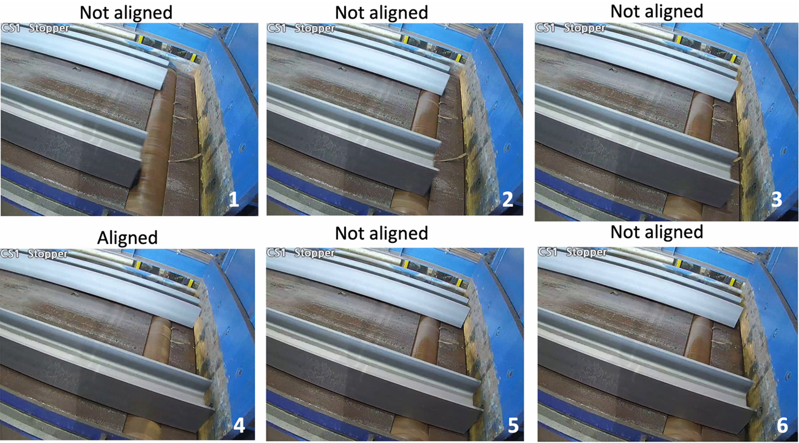
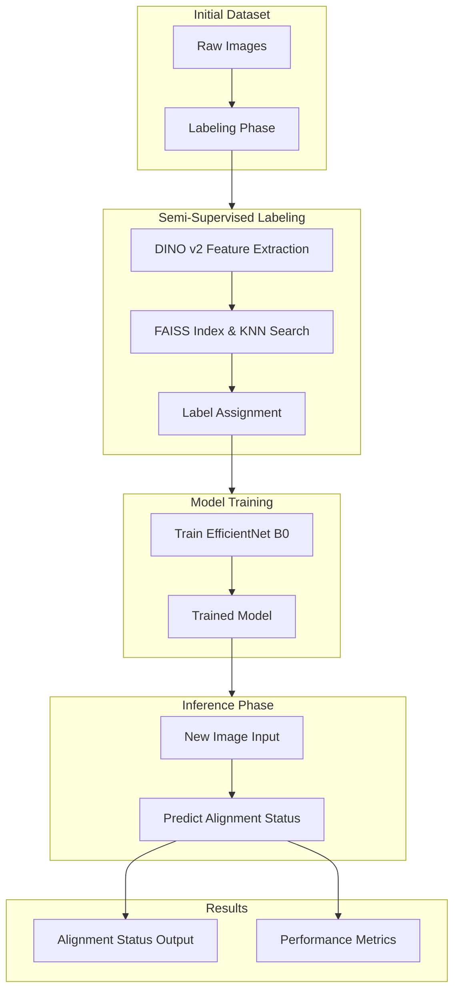

# ViT-KNN: Semi-Supervised Pseudo-Labeling with Vision Transformers and KNN 

This repository contains the codebase developed by the **CUDA_Libre** team for the [Neural Wave Hackathon 2024](https://neuralwave.ch/#/2024/recap), where our solution earned **1<sup>st</sup> place**. The project automates the verification of steel bar alignment in a rolling mill using state-of-the-art Computer Vision models, combining semi-supervised Vision Transformers (ViT) and KNN-based pseudo-labeling. By enhancing operational efficiency and reducing human error, this system offers a scalable solution to modernize steel bar manufacturing processes.

 
## Problem Context

Fig. 1 depicts a sequence of steel bars moving towards a stopper on a rolling table. The goal is to assess whether the bars are properly aligned. Currently, this alignment check is performed manually by human operators who rely solely on visual inspection of real-time images. Determining alignment can be challenging due to uncertainties caused by various factors, including perspective distortions, vibrations, shadows, and inconsistent lighting conditions.

<figure style="text-align: center;">
  
  <figcaption style="margin-top: 8px;">Fig. 1 Sample images showing a sequence of aligned and non-aligned bars approaching the stopper.</figcaption>
</figure>


<!-- ## Project Pipeline -->
## Project Pipeline

Manual inspection of steel bar alignment is a labor intensive task that can lead to errors due to operator fatigue. Our solution automates this verification, allowing plant operators to focus on more critical aspects of the production process. The workflow can be divided into two key stages:

1. **Semi-Supervised Labeling Workflow**
2. **Model Training and Inference**



## Methodology

### 1. Semi-Supervised Labeling Workflow

Given the large, mostly unlabeled dataset of 15,630 images, we developed an efficient labeling strategy combining manual and automated techniques:

- **Manual Labeling**: We labeled an initial subset of 5,000 images, creating a foundation for reliable training data.
- **DINO v2 for Embeddings**: We used [DINO v2](https://dinov2.metademolab.com/), a self-supervised vision transformer model, to generate high-dimensional embeddings of the images. These embeddings capture complex semantic features that make it possible to measure image similarity effectively.
- **K-Nearest Neighbors (KNN) with FAISS**: We applied [FAISS](https://github.com/facebookresearch/faiss) for fast, scalable similarity searches within the embedding space. For each unlabeled image, we identified its K-nearest neighbors and assigned a label based on a majority vote of their known labels.
- **Cosine Similarity**: To ensure robust label assignment, we utilized cosine similarity as the metric for calculating distances in the embedding space:

```math
\text{Cosine Similarity} = \frac{\mathbf{A} \cdot \mathbf{B}}{\|\mathbf{A}\| \|\mathbf{B}\|}
```
This method enabled us to expand the labeled dataset efficiently without manual effort for each image


### 2. Model Training and Inference
The expanded dataset was used to train an [EfficientNet B0](https://pytorch.org/vision/main/models/generated/torchvision.models.efficientnet_b0.html) model, chosen for its balance of accuracy and computational efficiency:

- **Preprocessing**: Images were resized to 256 pixels, centrally cropped to 224 pixels, and normalized using the mean [0.485, 0.456, 0.406] and standard deviation [0.229, 0.224, 0.225].
- **Model Architecture**: We fine-tuned EfficientNet B0, adapting the classification layer to output a binary classification result for the alignment status.
- **Training Details**: The model was trained for 30 epochs, with the optimal performance observed at epoch 10. Key performance metrics included:
  - **Accuracy**: 93.40%
  - **Precision**: 94.37%
  - **Recall**: 95.82%
  - **F1 Score**: 95.09%

## Results

The model demonstrated reliable classification capabilities with a mean inference time of **0.0298 seconds per image**, meeting the real-time requirement of under 0.5 seconds per image.

| **Inference Time Statistic** | **Time (seconds)** |
|------------------------------|---------------------|
| Mean Time                    | 0.0298              |
| 25th Percentile              | 0.0111              |
| Median (50th Percentile)     | 0.0117              |
| 75th Percentile              | 0.0128              |


## File Structure

The project includes the following main components:

- **`data/`**: Dataset handling scripts, including `DufercoDataset.py` and preprocessing utilities.
- **`dino/`**: Code for feature extraction and FAISS-based similarity searches.
- **`labeling_workflow/`**: GUI (`gui_labeler.py`) for manual labeling support.
- **`models/`**: Training scripts for EfficientNet and related models.
- **`train.py`** and **`test.py`**: Scripts for training and evaluating the model.
- **`requirements.txt`**: List of dependencies.

## Dependencies/Installation

Install the required packages with:
```bash
pip install -r requirements.txt
```

## Run the Code

### Training

Run the training script directly:
```bash
python train.py --data_config_path "dataset/processed_augmented_split.json" --batch_size 32 --num_epochs 30 --learning_rate 0.0001 --checkpoint_path "checkpoints/efficient_net"
```

### Testing

Evaluate the model using:
```bash
python test.py --data_config_path "dataset/split.json" --batch_size 16 --model_path "checkpoints/efficient_net/20241027_083453/model_epoch_10.pt"
```
## License
This project is licensed under the MIT License - see the [LICENSE](LICENSE) file for details.
